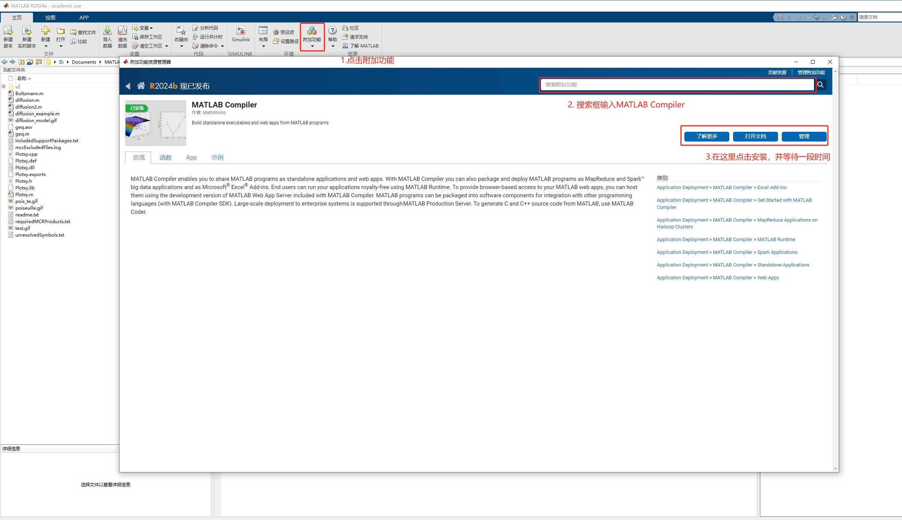
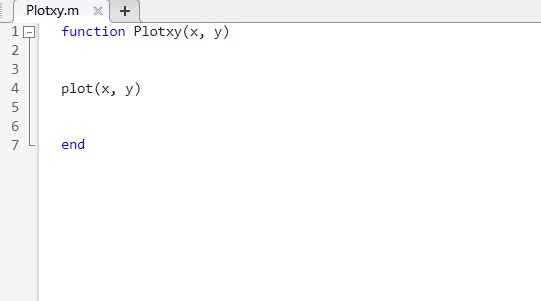
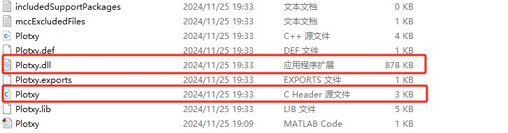

# CMake-C++调用matlab函数

要在C++中调用matlab的函数，可以通过调用matlab生成的dll文件来实现。

## 前置条件

CMake, C++(mingw64), matlab安装

matlab需要安装MATLAB Compiler工具包



安装完成后，需要先设置编译环境，这里以mingw64为例，

在matlab的命令行中输入

```matlab
setenv('MW_MINGW64_LOC', 'D:\Compiler\mingw64')
```

右边更换为编译器的地址，这里mingw64只需要索引到安装目录即可。

## 1. matlab输出dll文件

先在matlab中写一个简单的函数



在命令行输入

```matlab
mcc -W cpplib:Plotxy -T link:lib Plotxy.m
```

-W是封装格式，cpplib表示输出为C++的库，Plotxy是库的名字，Plotxy.m是源文件

命令执行后，会在源文件对应文件夹中出现一系列文件。

找到其中的头文件和动态库文件拷贝到C++的文档中。

这里为Plotxy.h  Plotxy.dll(Linux系统为Plotxy.so)



## 2. CMake链接dll文件

在链接之前，需要将MATLAB中必要的库先导入一下，导入的CMake代码为

```cmake
set(MATLAB_DIR "D:/Program Files/MATLAB/R2024a") # 地址改为matlab安装地址
include_directories(${MATLAB_DIR}/extern/include)
link_directories(${MATLAB_DIR}/extern/lib/win64/microsoft)
```

把dll文件加入到动态库中

```cmake
link_libraries(${PROJECT_BINARY_DIR}/../Plotxy.dll) # 地址改为dll文件的地址
```

然后在添加完可执行文件后，需要将mclmcrrt链接到可执行文件中

```cmake
target_link_libraries(myProject mclmcrrt)
```

完整代码为

```cmake
cmake_minimum_required(VERSION 3.31)
project(CMake_Test)

set(MATLAB_DIR "D:/Program Files/MATLAB/R2024a")
include_directories(${MATLAB_DIR}/extern/include)
include_directories(${PROJECT_BINARY_DIR}/../inc)

link_libraries(${PROJECT_BINARY_DIR}/../Plotxy.dll)

add_executable(myProject welcome.cpp)
target_link_libraries(myProject mclmcrrt)
```

## 3. C++调用MATLAB函数

C++代码如下

welcome.cpp
```cpp
#include<iostream>
#include "Plotxy.h"
#include "mclmcrrt.h"

using namespace std;

int main()
{
    if (!mclInitializeApplication(NULL, 0))
    {
        cout << "Could not initialize the application.\n";
        return -1;
    }
    double X[5] = {1, 2, 3, 4, 5};
    double Y[5] = {1.0, 1.5, 2.0, 2.5, 3.0};
    int len = 5;
    mwArray x(1, 5, mxDOUBLE_CLASS); //mwArray是matlabAPI的C++接口类型之一
    mwArray y(1, 5, mxDOUBLE_CLASS);
    for(int i = 1;i <= 5;i ++)
    {
        x(1, i) = X[i-1];
        y(1, i) = Y[i-1];
    }
    PlotxyInitialize(); //初始化Plotxy函数
    Plotxy(x, y); //调用Plotxy函数
    mclWaitForFiguresToDie(NULL);
    PlotxyTerminate(); //结束Plotxy函数
    mclTerminateApplication();
    return 0;
}
```

完成后，编译运行，运行可执行文件即可

**可执行文件exe运行时，需要保证Plotxy.dll在同目录下，否则可能会报错**