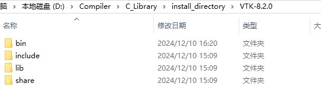

## 1. 开始一个CMake文件

开始CMake文件前，需要指定CMake所允许的最低版本

```cmake
cmake_minimum_required(VERSION 3.31)
```

接着，需要声明工程的名字

```cmake
project(myCMake)
```

将所需要编译执行的文件加入进来

```cmake
add_executable(Hello_world Hello_world.cpp)
```

如果要设定输出可执行文件的路径(当前目录为编译文件的目录)，可以

```cmake
set(EXECUTABLE_OUTPUT_PATH ./output)
```

## 2. 多文件编译

在一个文件夹里文件非常多时，可以将它们保存到一个变量中

```cmake
aux_source_directory(. SRC_LIST)
```
第一个参数是目录，第二个参数是变量名

增加新的头文件搜索目录

```cmake
include_directories(<dir>)
```
**将文件纳入执行文件目录后，CMake就会在build过程自动编译并生成可执行文件**

生成一个静态库或动态库

```cmake
add_library(func_shared SHARED ${SRC_LIST})
add_library(func_static STATIC ${SRC_LIST})
```
第一个参数是名称，第二个参数是类型，第三个参数是源文件

设置库文件输出路径

```cmake
set(LIBRARY_OUTPUT_PATH ${PROJECT_BINARY_DIR}/../lib)
```

修改库输出名称，这里将其统一命名为myfunc

```cmake
set_target_properties(func_shared PROPERTIES OUTPUT_NAME "myfunc")
set_target_properties(func_static PROPERTIES OUTPUT_NAME "myfunc")
```

链接库文件到可执行文件

```cmake
find_library(func_lib myfunc ${PROJECT_BINARY_DIR}/../lib)
target_link_libraries(Hello_world ${func_lib})
```

第一个函数将在指定目录下寻找myfunc库，并将其储存在func_lib变量中。

第二个函数将库文件链接到可执行文件中。

## CMake使用Eigen库

[参考文档](https://zhuanlan.zhihu.com/p/361969822)

```cmake
set(Eigen3_DIR "D:/Compiler/C_Library/install_directory/eigen-3.4.0/share/cmake") #设置Eigen搜索目录
find_package(Eigen3 3.4 REQUIRED NO_MODULE) #查找Eigen功能包
add_executable(welcome welcome.cpp)
target_link_libraries(welcome Eigen3::Eigen) #将Eigen库链接到可执行文件
```

## CMake导入vtk库

[参考文档](https://www.jianshu.com/p/07c51245424d)

vtk安装完成后，可以在安装目录下看到4个文件夹



为vtk设置vtk_dir，并寻找vtk包

```cmake
set(VTK_INSTALL_PREFIX "D:/Compiler/C_Library/install_directory/VTK-8.2.0")
set(VTK_DIR ${VTK_INSTALL_PREFIX}/lib/cmake/vtk-8.2) #设置vtk搜索目录
find_package(VTK REQUIRED) #查找vtk功能包
```

导入完成后，需要将头文件目录引入，并将库文件链接到可执行文件中

```cmake
include(${VTK_USE_FILE}) #导入头文件目录
add_executable(vtktest testvtk.cpp)
target_link_libraries(vtktest ${VTK_LIBRARIES}) #将vtk链接到可执行文件
```


## 参考

[CMake官方文档](https://cmake.org/cmake/help/latest/index.html)

[中文文档](https://modern-cmake-cn.github.io/Modern-CMake-zh_CN/chapters/basics.html)

[参考文档](https://blog.csdn.net/iuu77/article/details/129229361)

[参考文档2](https://zhuanlan.zhihu.com/p/315768216)