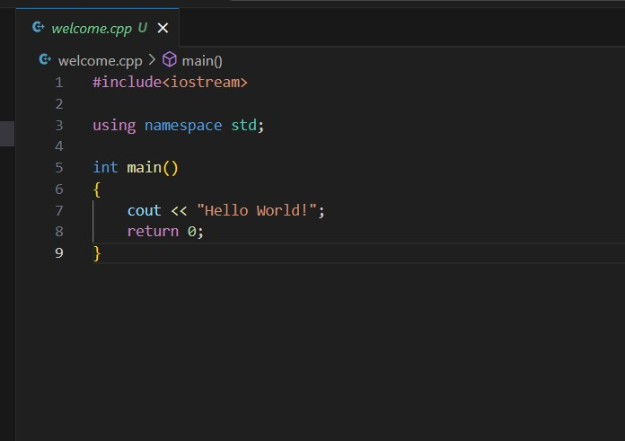
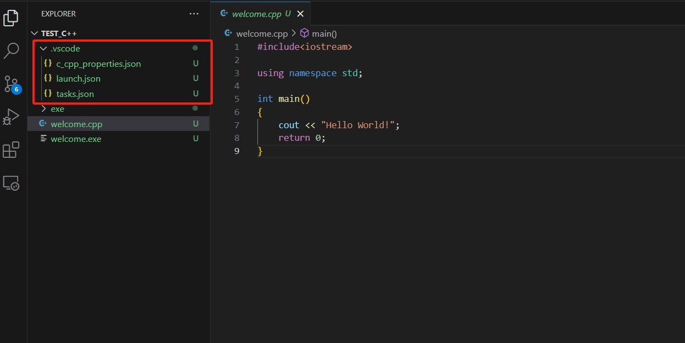

# Vscode-C++环境配置

[参考链接](https://zhuanlan.zhihu.com/p/679355387)

## 前置条件

Vscode, C++编译器（mingw64）安装

## 1.写一个C++测试文件



## 2.环境配置

Ctrl+F5运行测试文件，选择C++(GDB/LLDB)

此时会自动生成.vscode的文件夹，需要以下三个文件：



**task.json**

```json
{
    "tasks": [
        {
            "type": "cppbuild",
            "label": "C/C++: g++.exe build active file",
            "command": "D:\\Compiler\\mingw64\\bin\\g++.exe",//此处为C++编译器的位置
            "args": [
                "-fdiagnostics-color=always",
                "-g",
                "${file}",
                "-o",
                "${fileDirname}\\exe\\${fileBasenameNoExtension}.exe"//此处为可执行文件生成位置
            ],
            "options": {
                "cwd": "${fileDirname}"
            },
            "problemMatcher": [
                "$gcc"
            ],
            "group": {
                "kind": "build",
                "isDefault": true
            },
            "detail": "Task generated by Debugger."
        }
    ],
    "version": "2.0.0"
}
```

**launch.json**

```json
{
    "version": "0.2.0",
    "configurations": [

        {
            "name": "g++.exe - 生成和调试活动文件",
            "type": "cppdbg",
            "request": "launch",
            "program": "${fileDirname}\\exe\\${fileBasenameNoExtension}.exe",//此处为可执行文件生成位置
            "args": [],
            "stopAtEntry": false,
            "cwd": "${workspaceFolder}",
            "environment": [],
            "externalConsole":  false,
            "MIMode": "gdb",
            "miDebuggerPath": "D:\\Compiler\\mingw64\\bin\\g++.exe",//此处为C++编译器的位置
            "setupCommands": [
                {
                    "description": "为 gdb 启用整齐打印",
                    "text": "-enable-pretty-printing",
                    "ignoreFailures": true
                }
            ],
            "preLaunchTask": "C/C++: g++.exe build active file",
        }
    ]
}
```

**此处需要注意，task.json的label应该要和launch.json的preLaunchTask一致，否则运行后会报错**

[参考链接](https://blog.csdn.net/qq_43663476/article/details/124903618)

**c_cpp_properties.json**

```json
{
    "configurations": [
        {
            "name": "Win32",
            "includePath": [
                "${workspaceFolder}/**"
            ],
            "defines": [
                "_DEBUG",
                "UNICODE",
                "_UNICODE"
            ],
            "compilerPath": "D:\\Compiler\\mingw64\\bin\\g++.exe",//此处为C++编译位置
            "cStandard": "c17",
            "intelliSenseMode": "windows-gcc-x64",
            "cppStandard": "c++17"
        }
    ],
    "version": 4
}
```

配置完成后，测试的C++文件就可以运行了。

