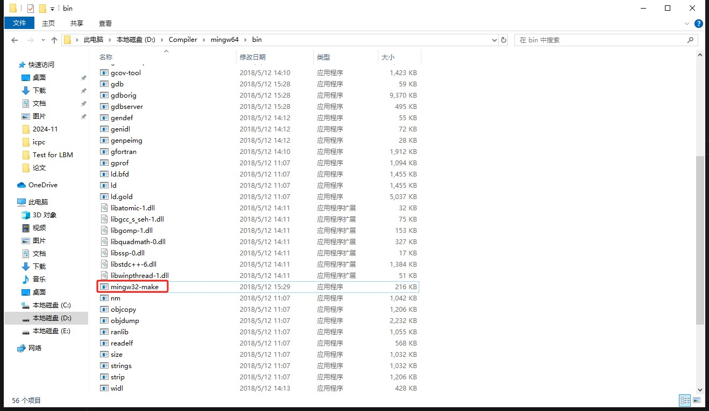

# VScode-CMake环境配置

## 前置条件

Vscode, C++编译器（mingw64）安装, CMake安装

## 1.写一个C++测试文件


## 2.同目录下创建一个CMakeLists.txt

在C++测试文件下创建一个CMakeLists.txt文件，在CMakeLists文件中输入CMake的代码。

## 3.配置编译环境

按下ctrl+shift+p, 输入查找并点击到CMake:Configure, 选择正确的编译器(如果Vscode有编译器环境，那么它会自己跳出来)。

## 4.编译运行

创建一个build文件夹，在文件夹下执行编译。

在Vscode终端输入

```
mkdir build
cd ./build
cmake ..
```

编译完成后，构建可执行文件。

这里以mingw64为例，找到环境配置目录下构建cmake的文件，如下



直接在Vscode终端输入

```
mingw64-make
```

当然实际上这个命令参数太长，可以将mingw64-make.exe直接重命名为make.exe，

这样直接在Vscode终端输入

```
make
```

就可以生成可执行文件。