# Vscode配置Github仓库工作环境


## 前置要求

安装git， vscode

## 1.创建github仓库
登录github网站，点击右上角打开个人菜单，打开your repositories, 点击new创建仓库，填好仓库名字，直接点创建即可。

创建成功后，方框处即为仓库的地址，这个要记起来，之后链接vscode要用

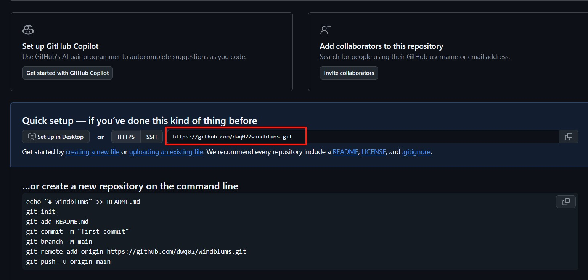

## 2.Vscode链接github仓库

打开Vscode, 点击左边Source Control


此时需要下载git，下载完成后，点击Vscode左下角Manage, 打开设置(Setting)，搜索框中输入git.path, 打开Edit in setting.json

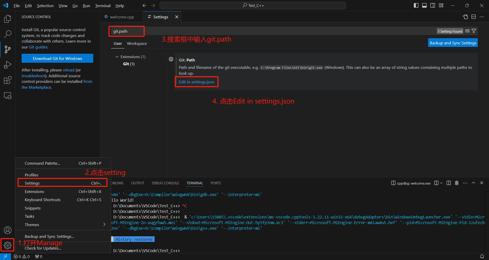

将git的安装目录输进去并保存

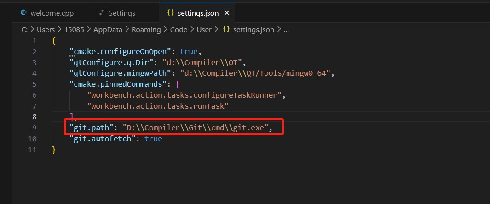

[参考链接](https://blog.csdn.net/czjl6886/article/details/122129576)

重新打开Source Control点击reload。或者重新打开Vscode，在点击Source Control, 点击初始化仓库
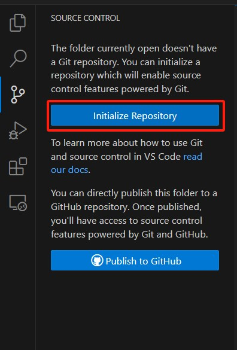

根据Vscode的提示完成登录

点击主页面上的clone rerepository

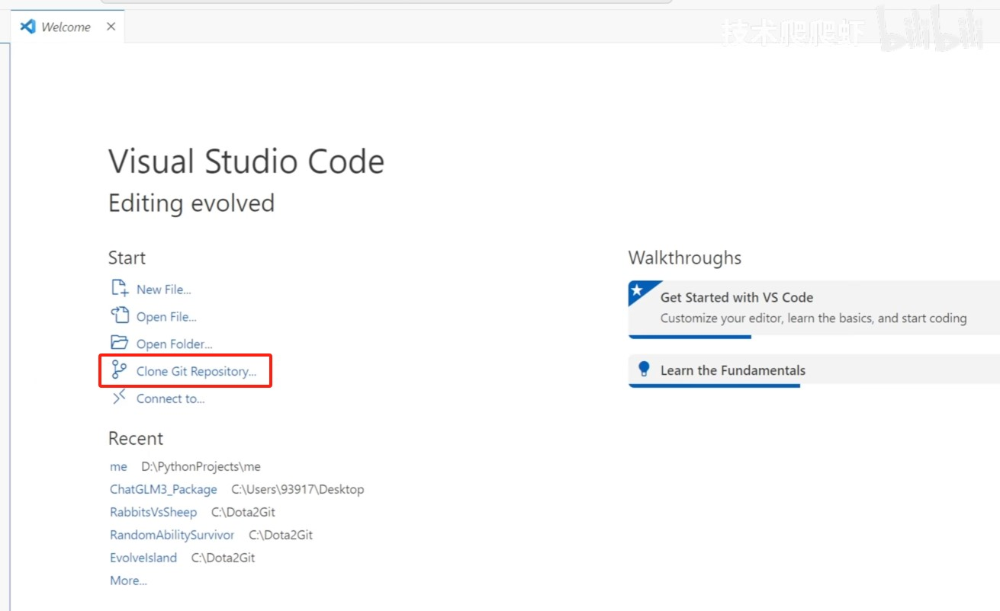

点击之后会弹出来一个选文件的弹窗，选择自己需要上传的工作文件夹

在上方输入第1点提到的仓库地址

- 报错提示：出现以下报错
- 
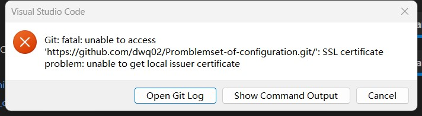

解决方法：打开cmd控制台，输入

```
git config --global http.sslVerify false
```
[参考链接](https://blog.csdn.net/weixin_44014995/article/details/109900149)

初始化完成后，Vscode就完成了与仓库的链接。

## 3.写入内容并提交

接下来写下项目代码以及README.md的markdown说明文档，这里以这个项目为例：
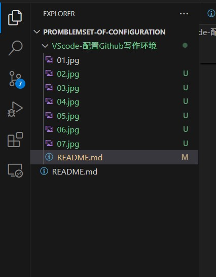

打开Source Control, 点击Commit提交

- 这里如果第一次安装git，可能会出现如下报错
- 
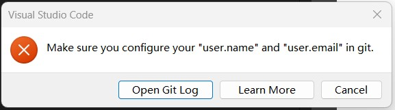

需要在cmd控制台输入以下命令

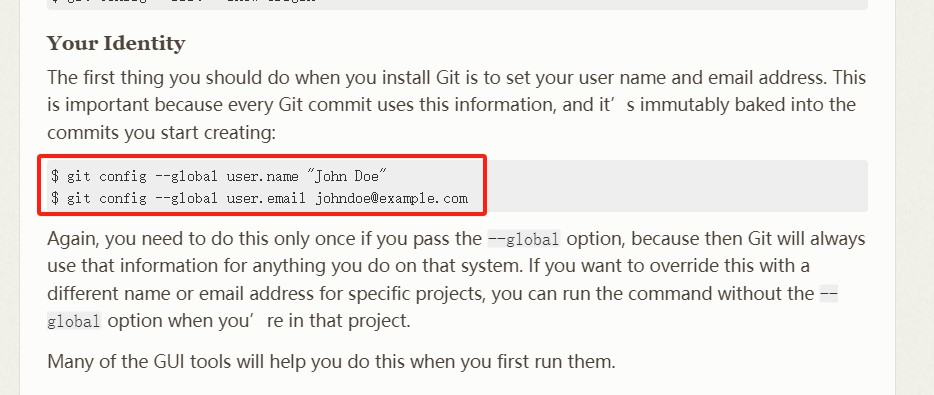

[参考文档](https://git-scm.com/book/en/v2/Getting-Started-First-Time-Git-Setup)

提交后，会出现一个文档，在最上方随便输入一个备注，然后点击上方的勾

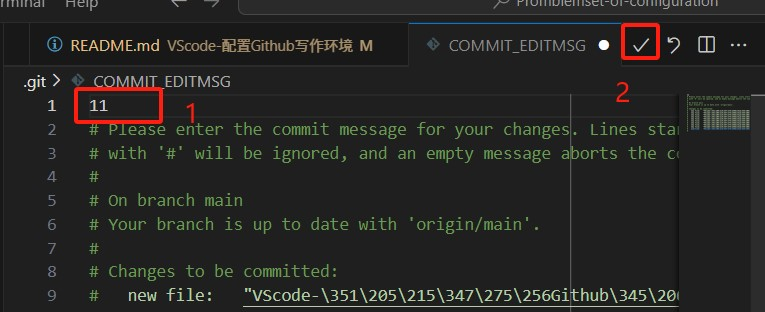

点击右上角三个点，点击push同步到github上

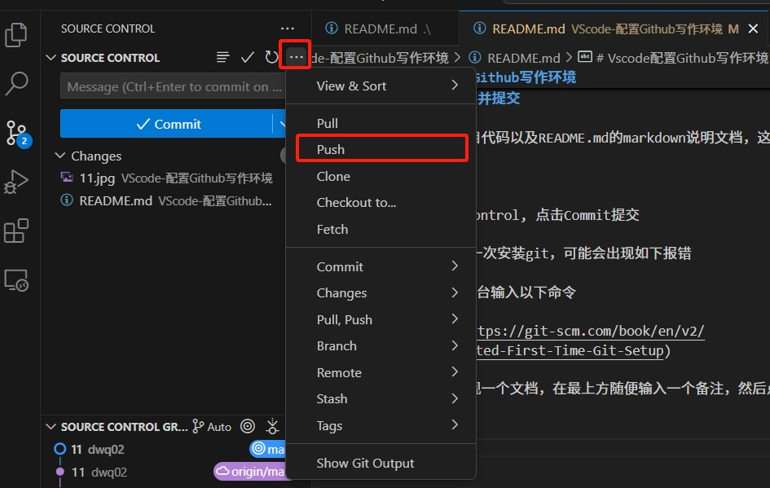

## 4.登录github网址，查看是否上传成功。


- [参考视频](https://www.bilibili.com/video/BV1jw41177sm/?spm_id_from=333.337.search-card.all.click&vd_source=af75e8cf52f63b22781c467b82b31e02)